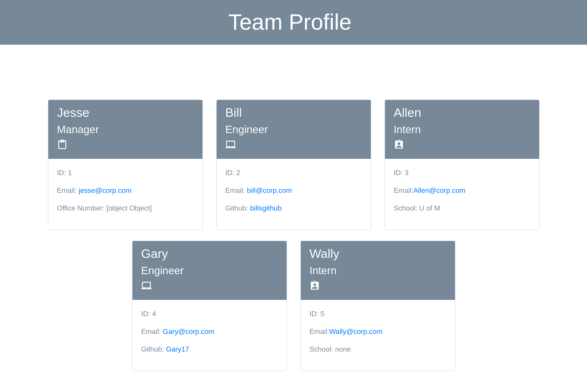

# Team Profile Generator [](https://opensource.org/licenses/MIT)

## Description

A Node.js program that takes user input describing team members and generates an HTML file displaying the entered data in a graphical format.

## User Story

```md
AS A manager
I WANT to generate a webpage that displays my team's basic info
SO THAT I have quick access to their emails and GitHub profiles
```

## Acceptance Criteria

```md
GIVEN a command-line application that accepts user input
WHEN I am prompted for my team members and their information
THEN an HTML file is generated that displays a nicely formatted team roster based on user input
WHEN I click on an email address in the HTML
THEN my default email program opens and populates the TO field of the email with the address
WHEN I click on the GitHub username
THEN that GitHub profile opens in a new tab
WHEN I start the application
THEN I am prompted to enter the team manager’s name, employee ID, email address, and office number
WHEN I enter the team manager’s name, employee ID, email address, and office number
THEN I am presented with a menu with the option to add an engineer or an intern or to finish building my team
WHEN I select the engineer option
THEN I am prompted to enter the engineer’s name, ID, email, and GitHub username, and I am taken back to the menu
WHEN I select the intern option
THEN I am prompted to enter the intern’s name, ID, email, and school, and I am taken back to the menu
WHEN I decide to finish building my team
THEN I exit the application, and the HTML is generated
```

## Table of Contents

- [Installation](#installation)
- [Usage](#usage)
- [Credits](#credits)
- [License](#license)

## Installation

run `NPM i` from command line.

## Usage

This program is free to use if you're an awesome dude/dudette!



## License

MIT License

## Contributing

Lessons and starter code from University of Minnesota coding bootcamp.

## Tests

ALl tests are located in the **tests** folder.

use "NPM test" to run.

## Questions

If you have any questions please reach out at <JesseCErickson@protonmail.com>

visit my Github profile at [clerick44](https://github.com/clerick44).
